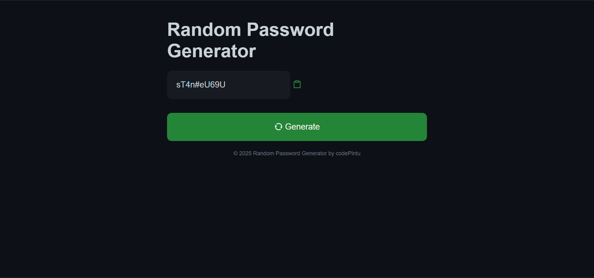

# 🔐 Random Password Generator

- [Live](https://random-password-generator-beta-rouge.vercel.app/)

- [code](https://github.com/CAP10D/random_password_generator.git)

A sleek, minimal, and accessible password generator built with **HTML**, **CSS**, and **Vanilla JavaScript**.  
It generates strong passwords on demand and lets you copy them with one click—no libraries, no fuss.

---

## ✨ Features

- **One-click generation** of strong random passwords  
- **Copy to clipboard** with a visual "Copied" popup  
- **Keyboard & screen-reader friendly**  
- Clean, responsive UI inspired by GitHub’s dark theme  
- Zero dependencies, works offline  

---

## 🚀 Quick Start

1. Download or clone the project.
2. Open `index.html` in your browser.
3. Click **Generate** to create a password, then click the **clipboard** icon to copy.

---
## demo

> **Note:** If you place the button inside a `<form>`, ensure it has `type="button"` or prevent default submission in JS. See _Troubleshooting_.

